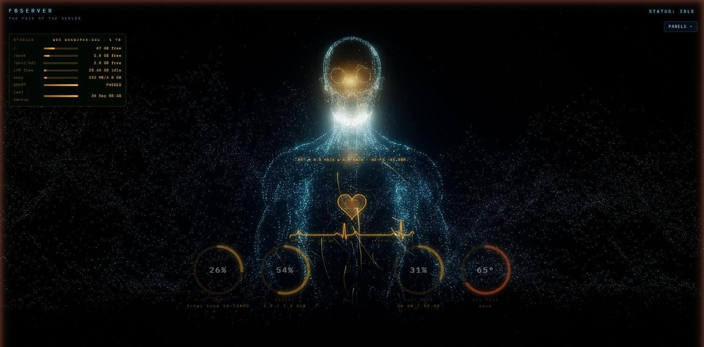
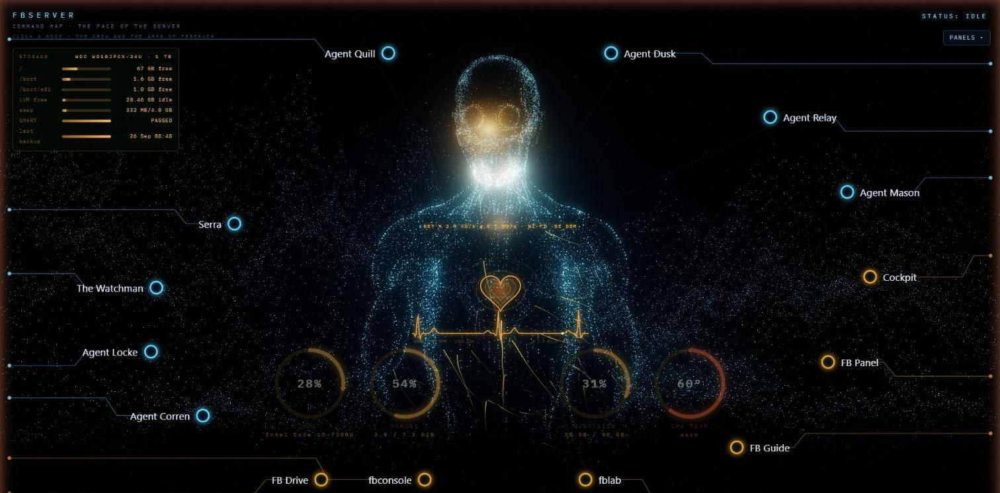
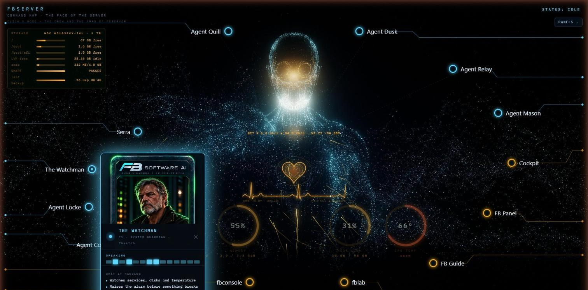
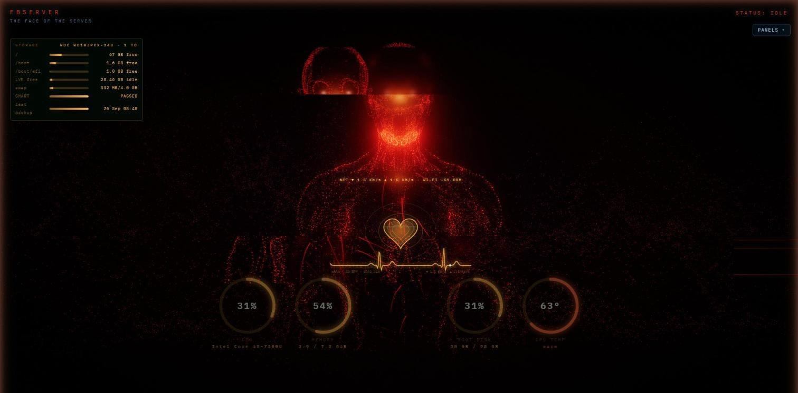
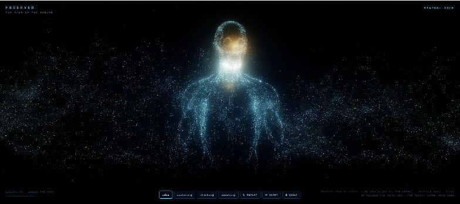

# Face of the Server

A living 3D particle figure for a server dashboard — it turns its head to follow you, assembles itself out of a swirl of particles when the page opens, glows when it speaks, and has a "scary" mode. One HTML file, no build step, no framework: three.js and hand-written GLSL shaders.



| | |
|---|---|
|  *Command Map — vitals on the figure, crew and apps around it* |  *The Watchman speaks: the arm clicks his node and his ID card opens* |
|  *☠ SCARY mode* |  *v1.0, the first version* |

Built by **Fatih Bora / FB Software Solutions** together with Claude (Anthropic) in one afternoon, for the *FB Server* project — a home Ubuntu server that talks to its owner through an AI crew. This figure is "the face of the server": the voice of the crew (Serra) gets a body on the dashboard.

*Türkçe:* Bu proje bir sunucu panosu için canlı bir 3B parçacık figürü. Fareyi veya web kamerasını takip eder, sayfa açılınca parçacıklardan kendini kurar, konuşurken parlar. Tek bir HTML dosyası; kurulum yok. Nasıl yapıldığı adım adım aşağıda.

---

## Try it

Open `index.html` in a modern browser (Chrome, Edge, Firefox). It needs internet once, to fetch three.js from cdnjs; everything else — including the 3D body — is inside the file.

| Control | What it does |
|---|---|
| move the mouse | the head and eyes follow you; background dust and the camera parallax with the movement |
| **idle / listening / thinking / speaking** | the four states of the assistant (rings pulse out of the head when listening, the core flickers when thinking, the figure lights up in rhythm with the voice when speaking) |
| **↻ REPLAY** | replays the assembly: particles stream in from an orb and form the body |
| **☠ SCARY** | blood-red palette, hot white eyes, head twitches, camera shake, screen tears |
| **■ QUIET** | stops the voice |
| **◉ CAMERA** | the figure looks at *you* through the webcam (face detection, motion fallback) — needs https or localhost |

`map.html` is the **Command Map**: the same figure with the server's vitals on it — a beating heart with the network graph, load rings behind the body, the storage list, veins that light up per heartbeat and change colour with the server status — and a radial map of the AI crew and apps around it. When a crew member speaks, the figure raises an arm, clicks the node, and the member's ID card pops open with a sound.

Add `?lite` to either page on a weak GPU (no bloom, fewer particles, no landscape). Localhost opens in lite mode by itself (that is the server's own screen).

For your own app the only hook you need is:

```js
window.serraLookAt(nx, ny);   // nx, ny in -1..1 (screen coordinates); call it from a webcam face tracker
```

and the `speaking` state: push a pulse into `pulses` (see the `speak` button handler) while your TTS plays.

---

## How it was made — step by step

This is the honest history, including the wrong turns, because that is what the project is about: learning to build things with an AI by describing what you want and looking at the result.

### 1. The reference
The look comes from a demo video of a humanoid AI interface: a dark screen, a human bust drawn as glowing contour rings made of particles, an orange energy core where the face would be, warm "veins" running from the throat down the chest, a particle mountain landscape behind, and an *ASSEMBLING… 35 %* build-up where the body forms out of a swirl. We extracted 19 frames from the video and studied three close-ups (assembly, face, landscape) before writing any code.

### 2. First try: a real scanned head (kept as a lesson)
The very first version was a 3D scan of a real face — a free image-to-3D model (Hunyuan3D-2.1 on Hugging Face) turned a portrait into a mesh, and 90 000 of its points became a hologram. It worked, but a real face made of points looks like a ghost, not a presence. We moved on.

### 3. A body from pure math
Version two had no model file at all. The bust was a formula: for every height *y* and angle *θ* a radius — an ellipsoid for the head, a cylinder for the neck, a widening superellipse for the shoulders, smoothly joined with a soft-max. That gives a clean featureless humanoid in a few lines of JavaScript. It looked like the reference but "like a barrel" — so we added pectorals, a collarbone dip, rounded shoulders and a taper below the chest. Still math, still not human enough.

### 4. Rendering: why it looked flat, and the fix
Plain WebGL lines are one pixel wide and cannot glow. The reference glows because of **bloom**. So the renderer became a small post-processing pipeline written by hand (three.js r128 core only, no `examples/` add-ons):

1. render the scene into a half-float render target (with MSAA when WebGL2 is available)
2. extract the bright parts (`brightMat`, soft threshold)
3. blur them at 5 resolutions — ½, ¼, ⅛, 1⁄16, 1⁄32 — with a separable 9-tap Gaussian (`blurMat`)
4. composite: scene + weighted bloom levels, vignette, film grain, **ACES filmic tone mapping** (`compMat`)

That single change made the difference between "kids' drawing" and the reference.

### 5. The particle body
Instead of drawing the surface, the figure is drawn as **points**: one particle per mesh vertex, plus a loose cloud around the crown of the head. Each point's brightness comes from a *fresnel* term — bright where the surface turns away from the camera — so the silhouette glows and the front stays faint, exactly like the reference. Every particle also has:

- `aStart` — a position on a swirl arc where it starts, and `aSeed` — its own schedule; during assembly each particle flies from `aStart` to its place along a curved path (`uBuild` 0 → 1 drives it)
- a "core weight" — how close it is to the face; those points turn orange and pulse with the voice
- a subtle sine "wave" on the face so the rings wobble like heat over the core

### 6. The head rig (mouse now, webcam later)
There is no skeleton. The vertex shader bends the model above the neck: `bend(p)` rotates every point about a pivot by the current yaw/pitch, weighted by `smoothstep` over the neck so the turn fades in smoothly. The target comes from the mouse; the same function `serraLookAt(nx,ny)` is what a webcam face tracker will call. Idle wander kicks in after five seconds without input.

### 7. Veins, dust, mountains
- **Veins**: a tiny recursive growth algorithm (`grow()`) walks down the front of the body, drifting and branching, and each branch becomes a thin `TubeGeometry` with a flowing pulse; orange at the trunk, cyan at the tips. Positions on the surface come from a 2D lookup grid built from the mesh (`frontZ(x,y)`).
- **Dust**: 5 000 particles around the figure. When the head turns, the dust is *swept* — the shader adds the head's angular velocity (`uDrift`), nearer dust more than far, so the background reacts to the movement.
- **Mountains**: a point grid with ridged value noise for height; orange "rivers" are greedy downhill walks over that height field.

### 8. Modes and the voice
`idle / listening / thinking / speaking` are one string that drives uniforms (`uListen`, `uThink`, `uLevel`). Speech uses the browser's `speechSynthesis` (an en-GB female voice when available); word boundaries push a level that the core, veins and particles react to.

### 9. The real body: a free écorché from Sketchfab
The math bust was replaced by a real anatomical model: **"Male Full Body Ecorche" by Diego Luján García** (Sketchfab, CC BY 4.0). Image-to-3D generators were tried first (Hunyuan3D-2.1, TRELLIS) but the free GPU quota ran out; a ready-made free model was the better answer anyway.

The GLB (26 MB, 640 k triangles, 16 sub-meshes) is far too big for a web page, so `tools/build_body.py` does the reduction:

1. reads the GLB by hand (JSON + binary chunk, scene-graph transforms applied) — no 3D library needed
2. crops to a bust (`--ycut -7`, everything below the waist dropped)
3. **vertex clustering**: snaps vertices to a grid — fine cells on the head (0.13), coarse on the body (0.33) — and merges them: 640 k → 174 k triangles, 64 129 vertices (just under the 65 536 limit of 16-bit indices)
4. normalises to the page's space (2.9 units tall, y up, centred)
5. quantises: positions to `uint16`, normals to `int8`, a "tendon" byte from the texture, indices to `uint16`
6. base64-encodes the lot (2.25 MB) and injects it into `index.html` as `const ECO`

The page decodes it on load in a few milliseconds. The lit red-muscle surface shader is in the file but not added to the scene — the particle-only look was chosen on purpose.

### 10. Things that were removed on purpose
A hologram pass (scanlines, rolling band, colour fringe, flicker), a projector cone with a ringed base disc, and the halo ring were all built, looked at, and taken out again. The glitch effects survive only inside the scary mode. Building, looking, deleting is part of the method.

---

## Use your own 3D model

```bash
pip install numpy pillow
python3 tools/build_body.py your-model.glb --ycut <y> --inject index.html
```

- `--ycut` is the model-space height below which everything is dropped (the script prints the model's y range first). Omit it to keep the whole model.
- If the script says "too many vertices", raise `--body-cell` (e.g. `0.4`).
- Any GLB works: the script applies the scene transforms and samples the base-colour texture if there is one (that is where the pale "tendon" tint comes from).
- After injecting, check three numbers in `index.html` that depend on where the head is in *your* model: `PIVOT` (neck height), `bw()` in `bendGLSL` (where the bend fades in), and the core/eye positions in `aim()`.

## Make it yours

Everything is in one file per page, in plain JavaScript and GLSL, and every number is near a comment saying what it does. Places people usually start:

| Want to change… | Look for |
|---|---|
| colours | `--cyan` / `--amber` in the CSS, `uVeinCol`, and `applyStatus()` for the status colours |
| how fast / slow the assembly is | `BUILD_MS` |
| the assembly sound, the click / open / close sounds | `window.sfx` (a tiny WebAudio synth — no sound files) |
| how far the head turns, idle wander | `aim()`, `serraLookAt()` |
| the arm gesture | `serraArm()`, `armL()` in `bendGLSL`, `gesture()` in map.html |
| the heart, ECG, BPM | the `heart` canvas block (`BPM = 58 + cpu·0.8`) |
| which agents / apps are on the map and where | the node list `N` in map.html (`x`, `y` are fractions of the screen) |
| where the vitals come from | `data.json` from fbconsole and `/speaking` — replace the fetches with your own JSON |
| the 3D body | `tools/build_body.py` (below) |

The `tools/patch_*.py` scripts are the actual patches we applied on the server, one feature each (lite mode, webcam, camera tuning, assembly sound). They are a good template for adding your own feature without touching the rest: find an anchor line, replace it, keep it idempotent.

Versions are tagged (`v1.0`, `v1.1`, …) and listed in `CHANGELOG.md`, so you can fork any of them.

## Files

```
index.html                              the Face (2.3 MB, body data included)
map.html                                the Command Map (Face + vitals + crew map)
tools/build_body.py                     GLB → embedded body data (crop, decimate, quantise, inject)
tools/patch_lite.py                     adds the ?lite mode
tools/patch_cam.py + tools/webcam.js    adds the CAMERA button (webcam look-at)
tools/patch_cam2.py                     camera gain / priority tuning
tools/patch_sound.py                    adds the assembly sound
CHANGELOG.md                            what changed in each version
docs/*.jpg, docs/face-of-the-server-screenshot.png   screenshots
CREDITS.md                              who made what, licences
LICENSE                                 MIT for the code in this repository
```

## Credits and licences

- Code: MIT (see `LICENSE`).
- Body mesh: **"Male Full Body Ecorche" by Diego Luján García** — Sketchfab, [CC BY 4.0](https://creativecommons.org/licenses/by/4.0/). The credit must stay wherever the figure is shown (it is in the page footer).
- three.js r128 — MIT.
- Font: IBM Plex Mono (Google Fonts, OFL).
- Concept reference: a humanoid-interface demo video (used for study only; nothing from it is in this repository).

Made with Claude, in the "FB Server" project — watch the build-along videos on the **AI ile kendin yap** channel.
