# Khoa on a hologram fan

Khoa floating in the air above the desk: a set of ready-made videos for a **3D hologram fan** (a spinning LED blade that shows video on black as if it were hanging in space), plus every tool used to make them.

Made for a **3dholo P30S** (28 cm, round picture ≈ 768 px across, MP4 via the *Holoscope* app, TF card or PC software). The videos are 768 × 768, 30 fps, H.264 + AAC, on pure black — black is "nothing" on a fan, so only Khoa and the gauges glow. They play on the other models of the same family too (the app scales them).

## The videos

| # | File | Length | What it is |
|---|---|---|---|
| 01 | `videos/01-khoa-test-clip-tr.mp4` | 22 s | First test: Khoa assembles and says *"Ben Khoa. Sunucunun yüzüyüm."* |
| 02 | `videos/02-fb-server-intro-tr.mp4` | 32 s | FB Server intro: particles form the FB SERVER logo, it breaks into dust, Khoa forms and introduces the server (Turkish), logo + fbserver.net at the end |
| 03 | `videos/03-khoa-english-intro.mp4` | 56 s | Khoa explains himself in English; his body changes colour with each topic; dust floats around him while he talks |
| 04 | `videos/04-khoa-english-with-gauges.mp4` | 74 s | Same script, but for every mode he bursts into dust and the matching gauge forms and fills while he talks |
| 05 | `videos/05-khoa-idle-loop.mp4` | 30 s | Idle loop: morph in (with the assemble sound) → looks around → dissolves into dust → repeats |
| 06 | `videos/06-khoa-natural-mode.mp4` | 70 s | Natural mode: no voice, all six gauges in turn with sci-fi sound effects |
| 07 | `videos/07-khoa-look-around-1min-hum.mp4` | 60 s | Khoa only looks around, soft sci-fi hum, seamless loop |
| 08 | `videos/08-khoa-look-around-1min-blips.mp4` | 60 s | Same, silent except a small blip on every head turn |
| 09 | **Release download** `khoa-presentation-idle-5min-P30S.mp4` | 5 min | **Presentation idle mode** — see below |
| — | `videos/situations/0-normal.mp4` … `8-alarm.mp4` | 20 s each | The nine server situations as separate clips: colour change, gauge ring, sci-fi rings, Turkish voice, no text |

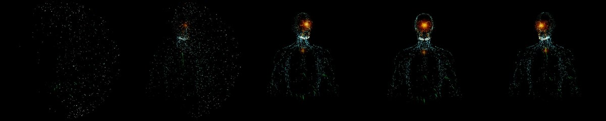
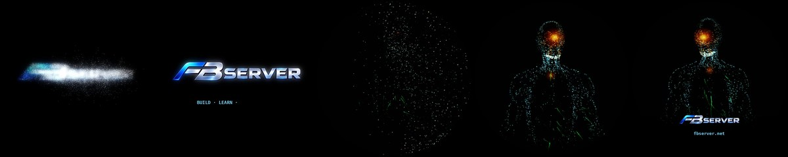
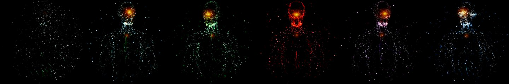
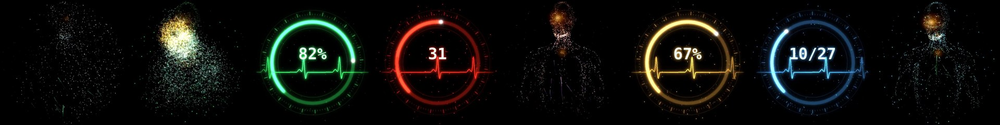
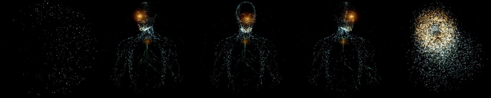
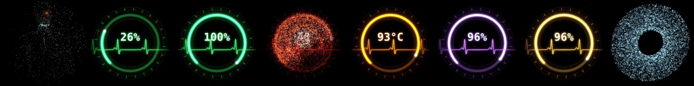
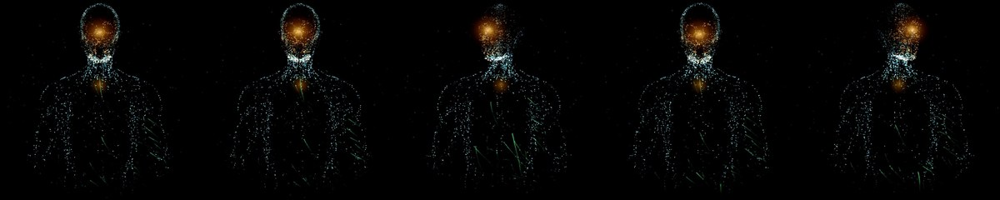
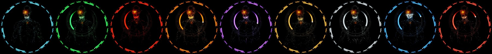

### 09 · Presentation idle mode (5 minutes)
The file is 106 MB — over GitHub's 100 MB limit for a file inside a repository — so it is attached to the **v1.4 release** as a download instead.

Khoa mostly just looks around (a blip on every head turn, no background sound). At irregular moments a gauge morphs in to show what the server is doing in the background, then Khoa re-forms. It tells one small story:

| Time | Gauge | Story |
|---|---|---|
| 0:34 | green | scheduled backup starts, 0 → 31 % |
| 1:12 | blue | update check finds 27 packages |
| 1:36 | purple | memory rises during the backup, 41 → 63 % |
| 2:01 | orange | CPU warms up, 52 → 71 °C |
| 2:30 | green | backup progress, 31 → 78 % |
| 3:01 | red | someone knocks — 12 failed logins, alarm pulse |
| 3:16 | orange | CPU cools down, 71 → 58 °C |
| 3:58 | green | backup finished, 78 → 100 % |
| 4:28 | amber | disk after the backup, 31 → 34 % |

The first and last half minute are calm and the end blends into the start, so it loops without a visible cut.

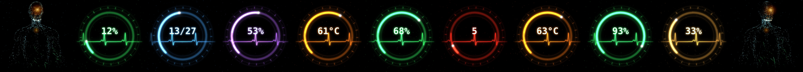

## Putting a video on the fan (P30S)
1. Turn the fan on. On your phone, join its Wi-Fi — the name is on the sticker (e.g. `P30S-0001062`), password `12345678`.
2. Open the **Holoscope** app → upload images/videos → pick the MP4. The app converts it for the fan.
3. Play it; use *single* playback to loop one video, *sequential* to run a playlist.

(Copying straight to a TF card needs the videos converted first — the PC software does that.)

## Mockups
The looks were approved from these before anything was rendered:

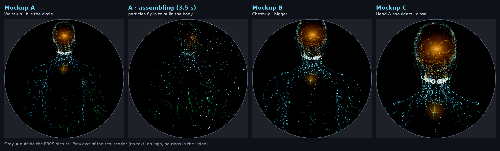
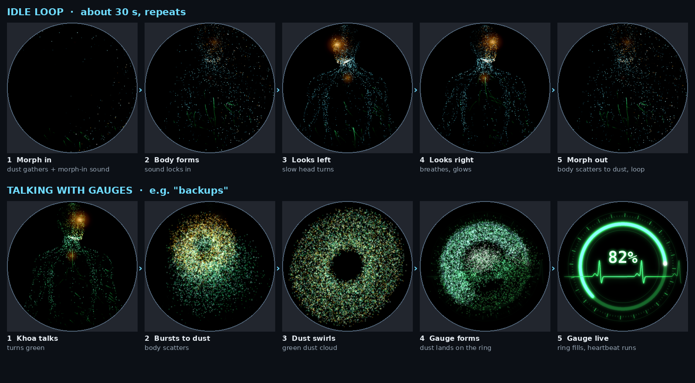
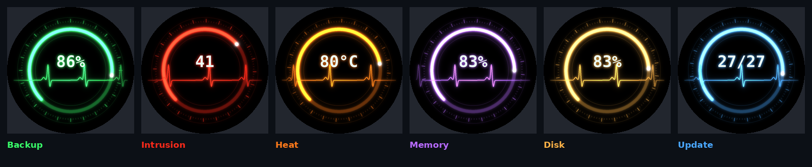

## Sounds
- `audio/assemble-sound.mp3` — Khoa's real morph-in sound, captured from the page's own Web Audio synth by rendering it offline.
- `audio/voice-en/l1…l9.mp3` — the English lines (Piper *en_GB-alan-medium*).
- `audio/voice-tr/` — the new Turkish lines of the FB Server intro (Piper *tr_TR-dfki-medium*, "voice of the server" style: slower, 3 semitones deeper, faint metallic echo).
- Gauge and blip effects are synthesized by `tools/sfx.py` / `tools/sfx_pres.py` (whoosh, lock-in thud + metallic ping, servo fill, ticks, heartbeat blips, alarm pulse, reform chime).

## How the videos are made (tools/)
The figure in every video is the real Khoa page, not a re-drawing:

1. **`make_holo_page.py`** turns `khoa-web.html` into `khoa-holo.html` (Turkish gauge sub-lines).
2. The page runs in headless Chromium (Playwright, SwiftShader) with a **virtual clock** (`clock.js`): time, timers and animation frames only advance when the renderer says so, so every frame is perfect even on a machine with no GPU. `notext.js` hides all canvas text, `camlock.js` keeps the camera still.
3. **`render_g.js <timeline>`** steps through a timeline (`tools/timelines/*.json`: situations, head turns, spoken lines) and screenshots every frame.
4. **`comp.py` / `comp_pres.py`** zoom the frame to fill the fan's circle, lift the brightness for LEDs, draw the **gauges** (`gauge.py`: ring, ticks, heartbeat line, value), do the **dust morph** between Khoa and the gauge (particles sampled from both pictures, they scatter, swirl and land), and add the floating dust.
5. **`sfx*.py`** synthesizes the sound design on the same timeline; **ffmpeg** mixes voice + effects and encodes.

Other tools: `logo_anim.py` (FB SERVER logo from particles), `rings.py` (sci-fi rings of the situation clips), `sit.js` (situation clips), `sfxcap.js` (captures the page's assemble sound), `tts.sh` / `tts_en.sh` (Piper voices), `sheet.py` (mockup sheets).
Paths inside the scripts point to the folders they were made in (`/root/holo`, `/root/khoa`) — change them to yours.
